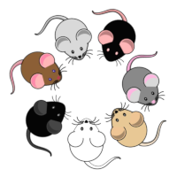

# reStrainingOrder
As part of this years's Cambridge area bioinformatics hackathon I'm going to start on a little QC tool that attempts to predict the genotype of mouse samples. This could be be used to check public data as well as provide useful knowledge of mouse strains commonly used in the lab.

Here is the link to the hackathon site: https://www.cambiohack.uk/
